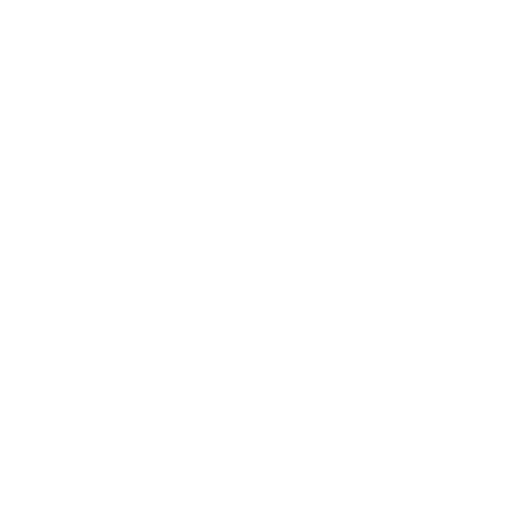

<link rel="stylesheet" href="https://cdn.jsdelivr.net/gh/devicons/devicon@v2.15.1/devicon.min.css">

<h1 align="center">Hi 👋, I'm Gustavo Eduardo ORDOÑO POMA</h1>
<h3 align="center">A passionate backend developer from Perú</h3>

- 🔭 I’m currently working on [a Chat Aplication](https://github.com/gopoma/chat-app-api)

- 🌱 I’m currently learning **Django and Angular**

- 👨‍💻 All of my projects are available at [https://gopoma.vercel.app/](https://gopoma.vercel.app/)

- 💬 Ask me about **Express**

- 📫 How to reach me **gordono@unsa.edu.pe**

<h3 align="left">Connect with me:</h3>

<h3 align="left">Languages and Tools:</h3>
<h4>BackEnd:</h4>
<section class="skills">
    <article class="skill">
        

            <a class="skill__link" href="https://expressjs.com" target="_blank" rel="noreferrer">
                <i class="devicon-nodejs-plain skill__img"></i>
            </a>
        

        <h4 class="skill__title">NodeJS</h4>
    </article>
    <article class="skill">
        

            <a class="skill__link" href="https://expressjs.com" target="_blank" rel="noreferrer">
                <i class="devicon-express-original skill__img"></i>
            </a>
        

        <h5 class="skill__title">Express</h5>
    </article>
    <article class="skill">
        

            <a class="skill__link" href="https://expressjs.com" target="_blank" rel="noreferrer">
                <i class="devicon-mysql-plain skill__img"></i>
            </a>
        

        <h5 class="skill__title">MySQL</h5>
    </article>
    <article class="skill">
        

            <a class="skill__link" href="https://expressjs.com" target="_blank" rel="noreferrer">
                <i class="devicon-mongodb-plain skill__img"></i>
            </a>
        

        <h5 class="skill__title">MongoDB</h5>
    </article>
</section>
<h4>FrontEnd:</h4>
<section class="skills">
    <article class="skill">
        

            
        

        <h5 class="skill__title">EJS</h5>
    </article>
    <article class="skill">
        

            
        

        <h5 class="skill__title">Pug</h5>
    </article>
    <article class="skill">
        

            <a class="skill__link" href="https://expressjs.com" target="_blank" rel="noreferrer">
                <i class="devicon-handlebars-plain skill__img"></i>
            </a>
        

        <h5 class="skill__title">Handlebars</h5>
    </article>
    <article class="skill">
        

            <a class="skill__link" href="https://expressjs.com" target="_blank" rel="noreferrer">
                <i class="devicon-tailwindcss-plain skill__img"></i>
            </a>
        

        <h5 class="skill__title">TailwindCSS</h5>
    </article>
</section>